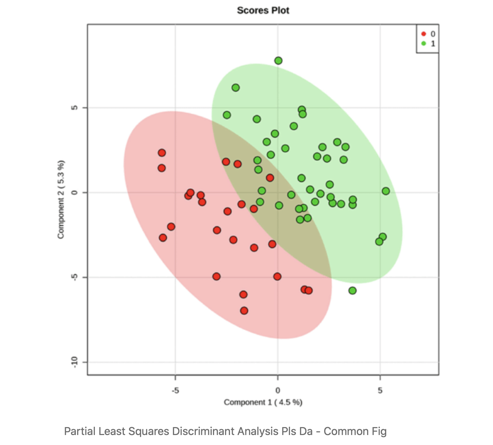
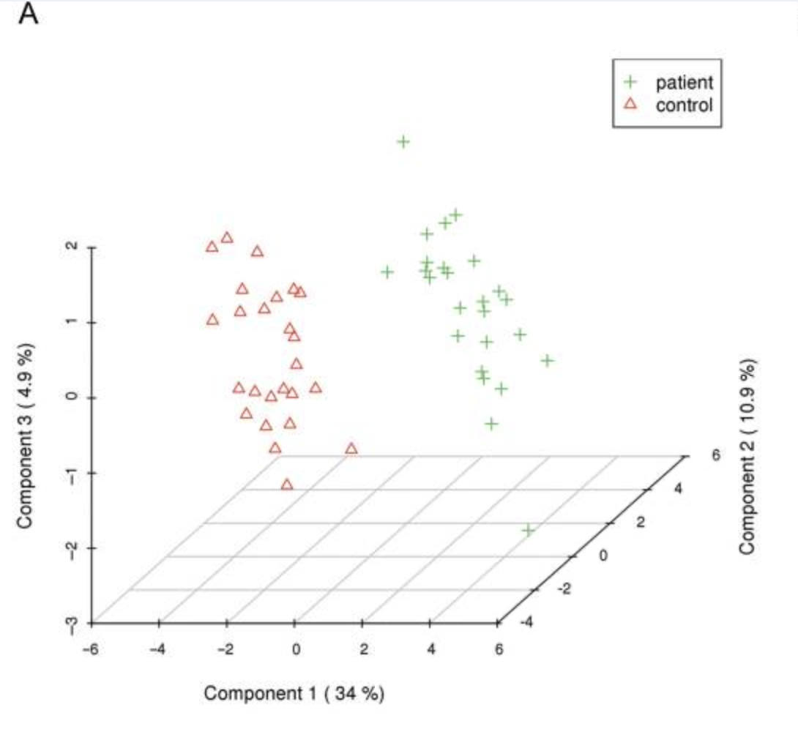
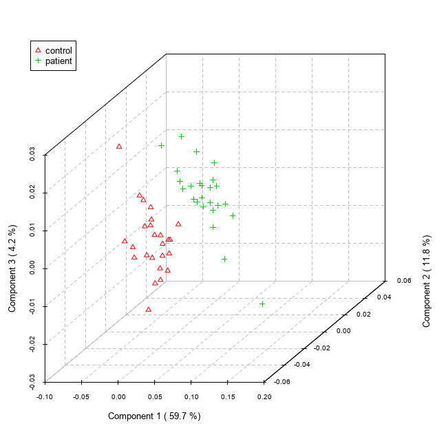
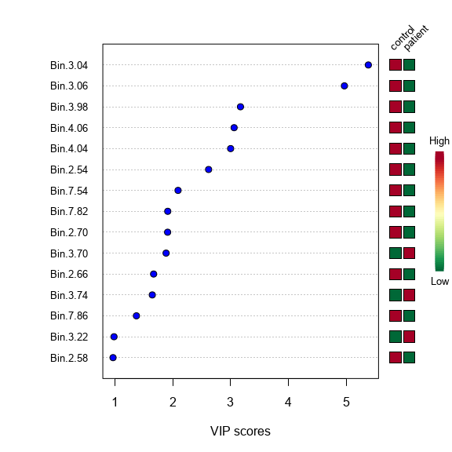
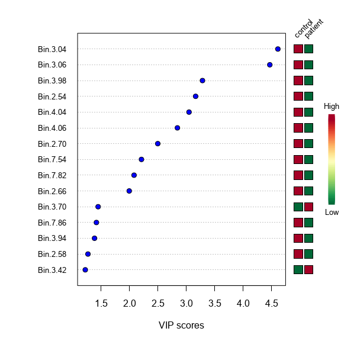

# 1. Introduction
The purpose of this repository is to serve as the home of the replication project for the paper [@Paper]. All relevant files, data, and code will be made available here in order to facilitate transparency and further reproducibility of this work. In this regard, the aim will be to minimize barriers and time required to perform future analyses. 

There are a number of data processing challanges germane to metabolomics. Some notable ones tend to include specialized knowledged and software, which is why there is much value to be had in lowering the accessibility barrier for analysis. To help simplify the process for some of the more common metabolomic data analyses, MetaboAnalyst offers an accessible tool capable of handling most kinds of metabolomic data. At least in regards to NMR/MS spectral data, our project intends replicate the work used to support this claim.

[@Web] is a web-based tool suite for comprehensive metabolomic data analysis, interpretation, and integration with other omics data. [@Wiki] It provides a variety of analysis methods that have been tailored for metabolomic data. These methods include metabolomic data processing, normalization, multivariate statistical analysis, and data annotation. It also supports a wide array of functions for statistical, functional and data visualization tasks. MetaboAnalyst supports a wide variety of data input types commonly generated by metabolomic studies including GC/LC-MS raw spectra, MS/NMR peak lists, NMR/MS peak intensity table, NMR/MS spectral bins, and metabolite concentrations.
MetaboAnalyst has four modules with the main features for each listed below:  

1. Data processing:  
    * Peak Detection  
    * Retention time correction  
    * Peak alignment  
    * Baseline filtering  
    * Data integrity check  
    * Missing value imputation  
2. Statistical analysis:  
    * Univariate, clustering, classification analysis  
    * Dimension reduction  
    * Two way ANOVA, ASCA  
    * Temporal comparison  
    * Feature selection  
3. Functional enrichment analysis:  
    * Over representation analysis  
    * Single sample profiling  
    * Quantitative enrichment analysis  
4. Metabolic pathway analysis:  
    * Enrichment analysis  
    * Topology analysis  
    * Interaction Visualization  


## Partial Least Square Discriminant Analysis (PLSDA)

Metabolomics is a field that studies metabolic changes in biological contexts by analyzing various methods (for example liquid gas chromatography etc) to narrow down on changes caused at the molecular level. Such data, a good example of which is spectral NMR data, is usually high dimensional and split into micro-arrays. The linear algebra that forms the backdrop of traditional linear methods fails with such high-dimensional data. 

This leads us to a dimension-reduction technique closely related to Partial Least Squares: Principal Component Analysis. PCA takes a matrix X of predictor variables as an input and performs dimension reduction by calculating linear combinations of features to summarize data without losing critical information. This makes both dimension reduction methods popular because not only is metabolomic data high dimensional, but is usually highly correlated as well. This sometimes results in a ‘singular matrix’ error where not all of the columns are linearly independent of each other. One way to observe this error via RStudio is to use Fisher’s Linear Discriminant Analysis (which does not perform dimension reduction) on metabolomic spectral data. PCA in particular side-steps this problem and calculates ‘principal components’ by eigenvalue decomposition of the covariance matrix (correlation matrix of predictor variables). The goal is that each successive principal component should explain as much of the variance in data as possible. 

However, the disadvantage of this method is that it does not take into account the relationship of the predictor variables X to Y, the response variable. This is critical in metabolomic contexts, for example if a researcher has two samples of data from seemingly healthy and unhealthy patients and wants to classify patients algorithmically. To give a supervised spin to PCA, Partial Least Squares interprets variance between predictor variables X as well as the relationship of X to the qualitative / categorical target variable Y. The output of PLS-DA is a ‘scores’ matrix that aids in predicting the target variable. One output of PLS-DA is a scores matrix—usually visualized as a scores plot in the figure below—that answers the key question of: ‘Are the groups actually different?’



While PLS-DA is a powerful algorithm that can work in a variety of contexts (with highly correlated data, high-dimensional data, few observations, no knowledge of underlying distribution), its main disadvantage is that its output cannot be interpreted as easily as p values or confidence intervals.  However, its increasing use in classification and biological as well as engineering fields means this is not a disadvantage as much as a feature of the algorithm.

# 2. Replicating Source: PLSDA Analysis of NMR Spectral Bin Data

Accompanying the web tool, there is a package available [@Package] that allows you to reproduce the exact R code that the website performs. This package has one or more functions that take care of each of the analysis steps performed in the website. 


We use the sample NMR spectral data that comes with the online tool [@Web] and is discussed in the paper [@Paper] for this analysis.


The tutorial gives a step by step process for replicating the results. 

#### 1. Data Upload

MetaboAnalyst has been designed to accept diverse data types including compound concentration tables (from quantitative metabolomic studies), binned spectral data, NMR or MS peak lists, as well as raw GC–MS and raw LC–MS spectra. For compound concentration or binned spectral data, MetaboAnalyst requires that they be uploaded as a comma separated values (CSV) table with class labels (control and abnormal, say) immediately following the sample names.

#### 2. Data Processing

The package first checks the sanity of the data to make sure that its in the proper format. 
The package in this stage is responsible for missing value replacement and data filtering.

Depending on the type of uploaded data, different processing strategies can be employed to convert the raw numbers into a data matrix suitable for downstream analysis. For compound concentration lists, the data can be used immediately after MetaboAnalyst's data integrity check. For binned spectral data, a linear filter is first applied in order to remove baseline noise. This is done because most data processing algorithms do not work properly with many near-zero values. For NMR and/or MS peak lists, MetaboAnalyst first groups the peaks across all samples based on their positions.

The purposes of data editor and data filter are to help improve the quality of data for better separation, prediction or interpretation. In particular, user can use data editor to remove outlier(s) which can be visually identified from PCA or PLS-DA scores plots); user can use data filter to remove noisy or uninformative features (i.e. baseline noises, near-constant-features). These features tend to dilute the signal and decrease the performance of most the statistical procedures. Be removing outliers and low-quality features, the resulting data will be more consistent and reliable.

Our sample data has 0% null values. And we do not use any filtering for replication purposes. 

#### 2. Data Normalization
At this stage, the uploaded data is compiled into a table in which each sample is formally represented by a row and each feature identifies a column. With the data structured in this format, two types of data normalization protocols—row-wise normalization and column-wise normalization—may be used. These are often applied sequentially to reduce systematic variance and to improve the performance for downstream statistical analysis.
You can normalize based on target, central values and log transformations.

We did not use any normalization techniques. 


#### 3. Statistical Analysis
The chemometric analysis path offers the two most commonly used chemometric methods—principal component analysis (PCA) and partial-least squares discriminant analysis (PLS-DA). PCA is an unsupervised method aiming to find the directions of maximum variance in a data set (X) without referring to the class labels (Y). 

We perform the PLSDA analysis on our data.
PLS-DA is a supervised method that uses multiple linear regression technique to find the direction of maximum covariance between a data set (X) and the class membership (Y). For both methods, the original variables are summarized into much fewer variables using their weighted averages. These new variables are called scores. The weighting profiles are called loadings. MetaboAnalyst provides various views commonly used for PCA and PLS-DA analysis. Users can specify each axis to view the patterns between different components. Both two-dimensional (2D) and three-dimensional (3D) views are implemented.


# 3. Replication Method

We have used the following code sourced from the Metaboanalyst to replicate the result.
The script for the code can be found under the 'analysis' folder titled '001-PLSDA_code.R'.
Comments have been added to the code for better explainability. 

```{r echo=FALSE, eval=FALSE}
# change eval = TRUE to run the code block
library(here)
source(here("analysis", "001-PLSDA_code.R"))
```


# 4. Figures

This is the target image that we are trying to replicate. We get this image from the paper[@Paper]. 



The image that we obtain after replicating the steps in the tutorial paper is below in Fig 2.
The paper does not talk about the specific data processing steps so we kept everything to a default.





# 5. Technical Variations : Observing change in the analysis

We will be changing three technical details in our analysis.


## 5.1 Imputation method
The first of the changes that we implemented was the imputation method for columns with less than 50% of missing values, which is set by default to "min". This method assigns half of the column's minimum positive value to the missing observations. The assumption of this approach is that most missing values occurred because the levels of abundance metabolites are below the detection limit, and this assumption is generalized for all the possible datasets used in the MetaboAnalyst website. We decided to change the imputation method to "mean", a more widely used method that imputes the mean value of the column to the missing values. Due to the nature of the dataset used, data provided for the testing of the tool, we believed that it should not make a difference.


As we expected, because of a lack of missing values in the data, the result did not change.


## 5.2 Filtering method
The second change we implemented was in the filtering of the data. The goal of this step is to identify the variables that are less likely to be used in the final model. The default method to filter the variables is by Interquantile Range (IQR). What we propose is to change this method to Standard Deviation (SD) as, like IQR, it performs well when identifying non-informative variables that mantain near-constant values throughout the entire experiment.

The output remained constant after changing the filtering method.


## 5.3 Component for Variable Importance
The package also generates feature importance graphs along with the PLSDA analysis. The feature importance function also takes into account, the component on which it calculates the importance. You can change the 'component' parameter and compare how the feature importace changes from one component to another. Theoretically, there must be not be too much of a change because the important features will appear more or less in the same order or rank for both components. 

Therefore, as you can see from the images below, we tried to plot the feature importace for the first and second component and we cans see that the results do not vary much. The first three most important features renain constant for both the components. 







# 6. Conclusion
As you can observe from Fig. 1 and Fig. 2, we have achieved a close to perfect replication. The results for the replicated analysis are significant. 

Having said that, there are some notoceable changes between the two figures. 
1. The principal componenent 1 have different values.
2. The scale for both axes are different
3. More points in the replicated figure

We believe that the original analysis had implemented some outlier removal technique. It would explain the difference in the first component, and why we get more outliers.


# 7. References cited

