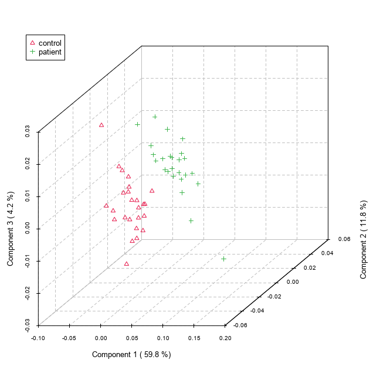

# 1. Introduction
The purpose of this repository is to serve as the home of the replication project. All relevant files, data, and code will be made available here in order to facilitate transparency and further reproducibility of this work. In this regard, the aim will be to minimize barriers and time required to perform future analyses. 

There are a number of data processing challanges germane to metabolomics. Some notable ones tend to include specialized knowledged and software, which is why there is much value to be had in lowering the accessibility barrier for analysis. To help simplify the process for some of the more common metabolomic data analyses, MetaboAnalyst offers an accessible tool capable of handling most kinds of metabolomic data. At least in regards to NMR/MS spectral data, our project intends replicate the work used to support this claim.


# 2. MetaboAnalystR


# 3. Partial Least Square Discriminant Analysis (PLSDA)


# 4. Replicating PLSDA Analysis of NMR Spectral Bin Data

We use the sample NMR spectral data that comes with the tutorial [1] in the online tool for this analysis. 
The package first checks the sanity of the data to make sure that its in the proper format. 

1. Data Processing
The package in this stage is reposnibke for missing value replacement and data filtering, 
The purposes of data editor and data filter are to help improve the quality of data for better separation, prediction or interpretation. In particular, user can use data editor to remove outlier(s) which can be visually identified from PCA or PLS-DA scores plots); user can use data filter to remove noisy or uninformative features (i.e. baseline noises, near-constant-features). These features tend to dilute the signal and decrease the performance of most the statistical procedures. Be removing outliers and low-quality features, the resulting data will be more consistent and reliable.

Our sample data has 0% null values. And we do not use any filtering for replication purposes. 

2. Data Normalization
You can normalize data using many methods. 
You can normalize based on target, central values and log transformations.

4. PLSDA
We perform the PLSDA analysis on our data. The code is below.


```{r echo=FALSE, eval=FALSE}
library(here)
source(here("analysis", "001-PLSDA_code.R"))
```

This is the target image that we are trying to replicate. We get this image from [1]. 


This is the image that we obtain after replicating the steps in the tutorial paper. 
The paper does not talk about the specific data processing steps so we kept everything to a default.




# 5. Change

## 5.1 Change in imputation method
We will be changing two technical details in our analysis. First, the default imputation method for columns with less than 50% of missing values is set to "min". This method assigns half of the column's minimum positive value to the missing observations. The assumption of this approach is that most missing values occurred because the levels of abundance metabolites are below the detection limit. This assumption is generalized for all the possible datasets used in the MetaboAnalyst website. We decided to change the imputation method to "mean", a more widely used method that imputes the mean value of the column to the missing values. This change shouldn't impact the output in a significant manner. Due to the nature of the dataset used, data provided for the testing of the tool, we believe that it should not make a difference.


## 5.2 Change in filtering method
The second change we implemented was in the filtering of the data. The goal of this step is to identify the variables that are less likely to be used in the final model. The default method to filter the variables is by Interquantile Range (IQR). What we propose is to change this method to Standard Deviation (SD) as, like IQR, it performs well when identifying non-informative variables that mantain near-constant values throughout the entire experiment.


## 5.3 Change in Component for Variable Importance
The package also generates feature importance graphs along with the PLSDA analysis. The feature importance function also takes into account, the component on which it calculates the importance. You can change the 'component' parameter and compare how the feature importace changes from one component to another. Theoretically, there must be not be too much of a change because the important features will appear more or less in the same order or rank for both components. 

Therefore, as you can see from the images below, we tried to plot the feature importace for the first and second component and we cans see that the results do not vary much. The first three most important features renain constant for both the components. 


# 6. References
